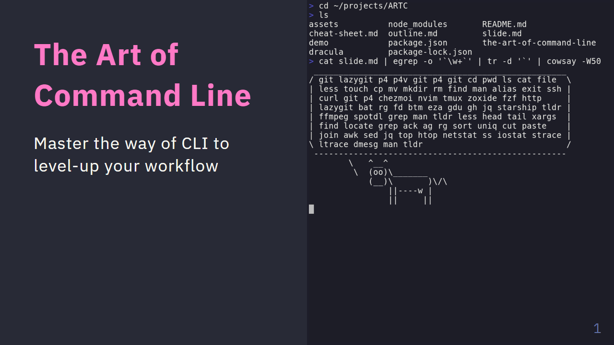

# The Art of Command Line



## Clone

```bash
git clone https://github.com/canh25xp/ARTC.git
git submodule --update --init
```

## Convert slide

```bash
npm install # Run once
npx marp slide.md
xdg-open slide.html
explorer.exe slide.html # for WSL
```

## Watch and Preview

```bash
npx marp slide.md --preview --watch
```

## Server mode

```bash
npx marp --server .
xdg-open http://localhost:8080/slide.md
```

## Troubleshoot

WSL convert to pdf failed

```
Error: spawn cmd.exe ENOENT
    at ChildProcess._handle.onexit (node:internal/child_process:285:19)
    at onErrorNT (node:internal/child_process:483:16)
    at process.processTicksAndRejections (node:internal/process/task_queues:90:21) {
  errno: -2,
  code: 'ENOENT',
  syscall: 'spawn cmd.exe',
  path: 'cmd.exe',
  spawnargs: [ '/c', 'SET', 'TMP' ],
  cmd: 'cmd.exe /c SET TMP',
  stdout: '',
  stderr: ''
}
```

Solution: ensure `cmd.exe` and `explorer.exe` is in the `PATH` environment

```bash
export PATH="$PATH:/mnt/c/Windows/system32:/mnt/c/Windows"
```
