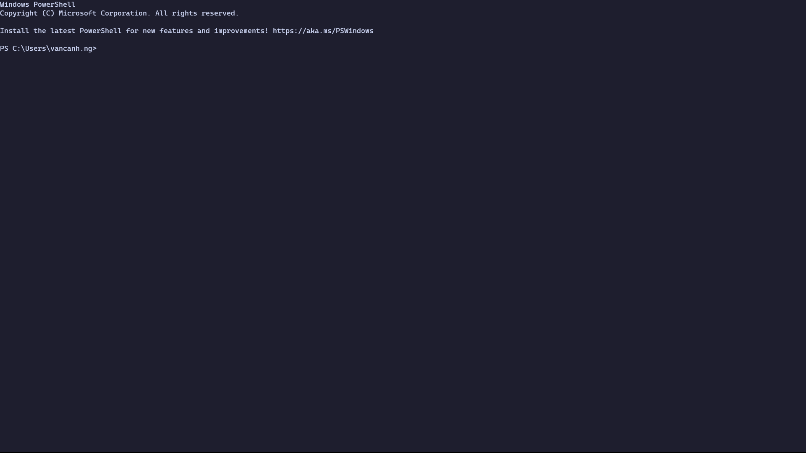
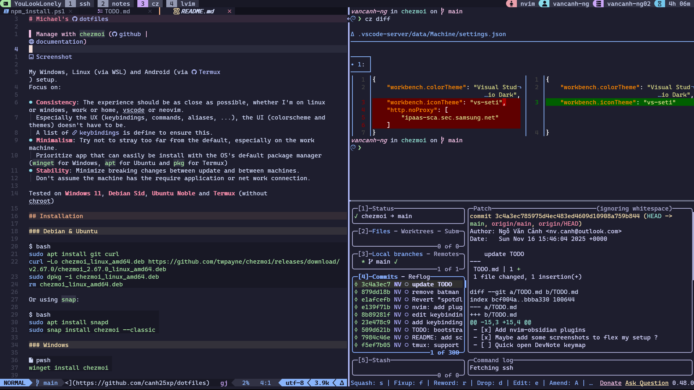

# The Art of Command Line


Master the way of CLI to level-up your workflow

---

## What is CLI ?

- **CLI**: Command Line Interface `git`
- **GUI**: Graphical User Interface `git-gui`
- **TUI**: Text User Interface `lazygit` <!-- Sometimes known as Terminal User Interface-->

---

## Why Bother Learning CLI ?

- Full access to applications
- Many GUIs are built on CLI counterparts:
  `p4` and `p4v`, `git` and `git-gui`
- Sometimes CLI is all you have:
  **Remote SSH** , **Cloud access** , **Container connections**
- Some applications only have CLI
- Scripting and Automation
- Fast and Lightweight

---

## Real world example

<!--
I cannot forget the day that my TL ask everyone in my team to apply a diff patch file manually.
Mind you, the patch was contains like 100 changed files with over thousand lines of code.
To be fair, we only use `p4` as the version control system, so it is understandable that the patch file meant to be apply with `git`.
-->

Applying a large patch:

```bash
git apply --ignore-space-change --ignore-whitespace --whitespace=nowarn --allow-empty f1968cb.diff
```

---

## Which Commands Should You Learn?

### The Basics

There's about **155** standard UNIX commands ([Wikipedia](https://en.wikipedia.org/wiki/List_of_POSIX_commands))

<!--
But to get started, these are the 15 commands that I think you should get familiar with.
-->

`cd`, `pwd`, `ls`, `cat`, `file`, `less`, `touch`, `cp`, `mv`, `mkdir`, `rm`, `find`, `man`, `alias`, `exit`

---

## Which Commands Should You Learn?

### The Intermediate

- `ssh`
- `curl`
- `git`
- `p4`

---

## Which Commands Should You Learn?

### The Advanced

Daily commands:

- `chezmoi`, `nvim`, `tmux`, `zoxide`
- `fzf`, `http`, `lazygit`, `bat`
- `rg`, `fd`, `btm`, `eza`
- `gdu`, `gh`, `jq`, `starship`
- `tldr`

---

Handy commands:

- `ffmpeg`, `yt-dlp`, `spotdl`

---



---



---

## How to Learn CLI?

### Understand Command Names

For example, `grep`:

- `g/re/p`: Globally search for a Regular Expression and Print

```bash
grep -E "[0-9]{1,3}\.[0-9]{1,3}\.[0-9]{1,3}\.[0-9]{1,3}" *.md
```

---

## How to Learn CLI?

### Use Documentation Tools

<!-- These are like the Linux Bibles -->

- `man` - Official documentation
- `tldr` - Simplified examples

### Don't Copy-Paste Blindly

<!--
When you're learning CLI, DO NOT copy-paste random script from Reddit.
That's basically playing Russian roulette with your files, or worse, whole file system.

I've once losing my whole git branch for my project by running `git revert` blindly.
Although later I learnt that you can actually revert the `git revert` command itself.
-->

- Avoid running random scripts from the internet
- Understand what commands do before executing them

---

## Tips from "The Art of Command Line"

### Basics

- Learn Bash well (`man bash`)
- Master a text-based editor (Vim/Emacs)
- Understand file management (`ls -l`, `less`, `head`, `tail`)
- Learn redirection (`>`, `<`, `|`)
- Know job management (`&`, `ctrl-z`, `ctrl-c`)

---

## Tips from "The Art of Command Line"

### Everyday Use

- Use **Tab** for completion
- Use **ctrl-r** for command history search
- Use **ctrl-w** to delete last word
- Use **ctrl-u** to delete to start of line
- Use `xargs` for powerful command chaining

---

## Tips from "The Art of Command Line"

### Processing Files and Data

- `find` and `locate` for file searching
- `grep`, `ack`, `ag`, `rg` for text searching
- `sort`, `uniq`, `cut`, `paste`, `join` for text manipulation
- `awk` and `sed` for data munging
- `jq` for JSON processing

---

## Tips from "The Art of Command Line"

### System Debugging

- `top`/`htop` for system monitoring
- `netstat`/`ss` for network connections
- `iostat` for disk I/O statistics
- `strace`/`ltrace` for system call debugging
- `dmesg` for kernel messages

---

## More Resources

- `man` pages - Official documentation
- `tldr` - Simplified examples
- [The Art of Command Line](https://github.com/jlevy/the-art-of-command-line) - Comprehensive guide
- `curl cheat.sh/command` - Quick cheat sheets
- [Explainshell](http://explainshell.com/) - Command breakdown

---

## Thank You !

Feel free to have leave any question
