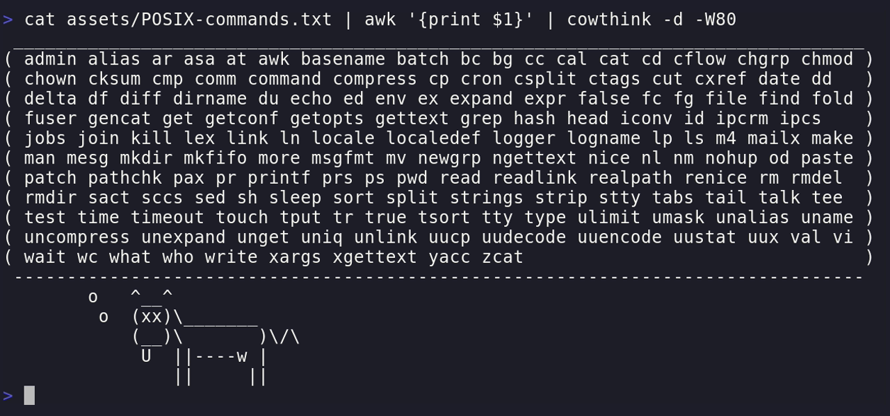

# The Art of Command Line


Master the way of CLI to level-up your workflow

<!--
This seminar is a concentrated of my 5 years of using linux.
To be teach you all of it is impossible.
-->

---

## Table of Contents


<!-- - [What is CLI ?](#3) -->
<!-- - [Why Bother Learning CLI ?](#5) -->
<!-- - [Basic of CLI](#9) -->
<!-- - [Which Commands Should You Learn?](#19) -->
<!-- - [How to Learn CLI?](#27) -->
<!-- - [Tips and tricks](#37) -->

- What is CLI
- Why using CLI ?
- Basic of CLI
- Which Commands Should You Learn
- How to Learn CLI
- Tips and tricks

---

## What is CLI ?

A CLI application is:
Any applications that you can interact with it from the Shell.

<!-- prettier-ignore -->
* **CLI**: Command Line Interface `git`, `p4`, `odin4`
* **GUI**: Graphical User Interface `git-gui`, `p4v`, `odin4v`
* **TUI**: Text User Interface `lazygit`, `vim` <!-- Sometimes known as Terminal User Interface. TUI is a subset of CLI-->

<!-- Some applications is a mixture of both CLI and GUI (`code --help`) -->

By interact I mean it should at least have a help menu.
That is, you should be able to open help by using 1 of the following flag: `--help`, `-h`, `-help`, `help`, `/?`, `/help`.

---

## Why Bother Learning CLI ?

<!-- Khả năng tiếp cận -->
<!-- Khả năng tái hiện -->
<!-- Khả năng mở rộng -->
<!-- Tự động hóa -->
<!-- Hiệu năng -->

- Accessibility <!-- Sometimes CLI is all you have:
  Remote SSH, Cloud access, Container connections...
  Some applications only have CLI.
  Some applications are built on top of their CLI counterparts but only CLI give you full access and control (p4 vs p4v, git vs git-gui) -->
- Reproducibility <!-- Whether reporting an issue or documenting a guide,
  A sequence of commands is just easier to reproduce than a list of screenshots. -->
- Extensibility <!-- Easily extend with other applications:
  chezmoi and fzf, pass and git, ... -->
- Automation <!-- Automate tasks via scripting -->
- Performance <!-- Fast and Lightweight -->

* Make you cooler😎

---

## Why Bother Learning CLI ?

<!--
I cannot forget the day that my TL ask everyone in my team to apply a diff patch file manually.
Mind you, the patch was contains like 100 changed files with over thousand lines of code.
To be fair, we only use `p4` as the version control system, so it is understandable that the patch file meant to be apply with `git`.
-->

Applying a large patch:

```bash
git apply --ignore-space-change --ignore-whitespace --whitespace=nowarn --allow-empty f1968cb.diff
```

---

## Terminal vs Shell

If your **keyboard** is a **pen** then the **terminal** is your **notebook**, and **shell** is the **page**.

A **terminal** might allows you to run many different **shell**, run many **shell** at the same time.

- **Terminal**: `wt` (Windows Terminal), `console`, `alacritty`, `wezterm`, `kitty`, ...
- **Shell**: `pwsh`, `cmd`, `bash`, `zsh`, `fish`, `nushell`, ...

---

## `pwsh` vs `bash`

<style scoped>
table {
    width: 100%;
    table-layout: fixed;
}
</style>

<!--
`pwsh` differs to `bash` in many area such as syntax, keyboard shortcut, auto completions, ...

The biggest different being `pwsh` is a full-featured, object-orientated programming language.
Meaning it support proper error handling, and blabla
-->

| `pwsh`                                                      | `bash`                              |
| ----------------------------------------------------------- | ----------------------------------- |
| Cross-platform                                              | Unix only                           |
| Output is **.NET objects**                                  | Output is **text streams**          |
| Has Verb-Noun cmdlets (`Set-Location`, `Get-Location`, ...) | Has shell builtin (`cd`, `pwd`,...) |

- `powershell.exe`: the legacy powershell (stop at version _5.1_)
- `pwsh.exe`: newer version of powershell

---

## `pwsh` vs `bash`

Cmdlet have the advantages of being well integrated into powershell but that's also it's weaknesses: it cannot be used independently.
Meaning other tool cannot use it directly.

```bash
# This only works in bash, it will NOT work in powershell
fzf --preview "cat {}" --query $query -1 -0
# Has to be used with `pwsh`
pwsh -NoProfile -Command "Get-Content -Path {}" --query $query -1 -0
# Or use a standalone binary
fzf --preview "bat {}" --query $query -1 -0
```

---

## Basic of CLI

<!--
Most of the times, a command look something like this.

Everything come after the command are called arguments.

Where first, second, third is called positional arguments.
-->

```sh
command --flag value first second third
```

<!-- prettier-ignore -->
- **command** could be one of these type:
  * An **_executable_**:
    * A **_binary_**: `ls`, `grep`, `cat`, `cp`, `mv`, `git`, `p4`, `curl`,... `*.exe`
    * A **_script_**: `*.sh`, `*.ps1`, `*.bat`, `*.vbs`
  * An **_alias_**: `ll`, `la`, `egrep`, `fgrep`
  * A **_shell functions_**: `function tf() { echo TheFork }`
  * A **_shell builtin_** (`bash` specific): `cd`, `pwd`, `alias`, `history` ,`type`
  * A **_cmdlet_** (`pwsh` specific): `Set-Location`, `Get-Content`, `Out-Host`

---

## Basic of CLI

<!-- Some command comes with a variety of **subcommand** -->

```sh
command subcommand --flag value first second third
```

**subcommand** always comes right after the command itself.

```sh
git commit --message "Some changes"
```

Some applications has many nested **subcommand**

```sh
gh repo clone canh25xp/ARTC
gh repo fork canh25xp/ARTC
```

---

## Basic of CLI

### Some special cases

To reduce ambiguity between the value of a flag and a positional arguments, some applications use the **key=value** pair

```sh
command --flag=value first second third
```

<!-- Here the `--flag` arguments is shorten to `-f` -->

---

## Basic of CLI

### Some special cases

Shorten flags

```sh
command -f value first second third
```

Most of the time, shorten flags come after a single dash `-`,
and long flag come after a double dash `--`.

<!-- Here the `--flag` arguments is shorten to `-f` -->

---

## Basic of CLI

### Some special cases

Boolean flags (or switches)

```sh
command --bool first second third
command -b first second third
```

Shorten boolean flags sometimes grouped together

```sh
command -a -b -c first second third
command -abc first second third # Same as above
```

---

## Basic of CLI

### Some special cases

Sometimes, cli applications allow flag and value sticks together

```sh
command -f value first second third
command -fvalue first second third
```

For example:

```sh
7z x archive.zip -oOutput
```

---

## Basic of CLI

### Shell expansions

<!-- The shell rewrites many arguments **before** launching your program. -->

- **Pathname/glob**: `*.c`, `**/*.c`
- **Variable/tilde**: `$HOME`, `~`, `$env`
- **Arithmetic**: `$((1 + 2))`,
- **Command substitution**: `$(pwd)`

These arguments are handle by the shell, not the program

---

## Basic of CLI

### Shell expansions

```c
// test.c
#include <stdio.h>
int main(int argc, char *argv[]) {
  for (int i = 0; i < argc; i++)
    printf("argv[%d] = %s\n", i, argv[i]);
  return 0;
}
```

Compile and run with `gcc ./demo/shell-expansion/test.c -o test && ./test *.md`

---

## Basic of CLI

### Shell expansions

Quote arguments to opt out of specific expansions

```bash
$ ./test *.md $((1+2))
argv[0] = './test'
argv[1] = 'cheat-sheet.md'
argv[2] = 'slide.md'
argv[3] = '3'

$ ./test "*.md" '$((1+2))'
argv[0] = './test'
argv[1] = '*.md'
argv[2] = '$((1+2))'
```

---

## Basic of CLI

### Shell expansions

What about this case ?

<!--
Here, since `p4*` does not match any filename under current working directory.
So the arguments is parse literally and `apt` responsible for expand the package name.
-->

```sh
$ apt list p4*
p4-cli/noble,now 2025.2-2852709~noble amd64 [installed,automatic]
p4-proxy/noble 2025.2-2852709~noble amd64
p4-server/noble 2025.2-2852709~noble amd64
```

Try `touch p4v` and run `apt list p4*` again. The command now return nothing.

---

## Which Commands Should You Learn?

There's about **155** standard UNIX commands ([Wikipedia](https://en.wikipedia.org/wiki/List_of_POSIX_commands))



---

## Which Commands Should You Learn?

### Basic commands

<!--
But to get started, these are the 15 commands that I think you should get familiar with.
-->

File management: `touch`, `mkdir`, `cat`, `cp`, `mv`, `rm`, `file`, `grep`

Navigation: `cd`, `pwd`, `ls`

Process management: `ps`, `kill`

Shell manipulation: `exit`, `clear`

---

## Which Commands Should You Learn?

### Intermediate commands

Data manipulating: `sort`, `uniq`, `cut`, `paste`, `join`, `awk`, `sed`.
System monitoring: `top`, `htop`
Data transferring: `curl`, `wget`
Networking: `netstat`, `ifconfig`, `ipconfig`
Disk management: `du`, `df`

---

## Which Commands Should You Learn?

### Package managers

<!--
Avoid the pain of manually download and install every tools.
Learn to use a package manager.
-->

Learn to **search**, **list**, **install** and **uninstall** packages.

- Windows: `winget`, `scoop`, `choco`
- Ubuntu/Debian: `apt`, `snap`, `flatpak`
- Language specific: `cargo`, `go`, `npm`, `pip`

---

## Which Commands Should You Learn?

### Package managers

In `apt`, some language specific package start with prefix.
For example:
`gem install github-linguist` -> `apt install ruby-github-linguist`
`pip3 install ruff` -> `apt install python3-ruff`

So check the package with apt first before install with the language package manager.

---

## Which Commands Should You Learn?

<!--
Now that you know most basic to intermediate commands.
It's time to move on to some commands that will actually boot your productivity.
-->

### My everyday commands

- [`ssh`](https://www.openssh.com/), [`tmux`](https://github.com/tmux/tmux), [`nvim`](https://github.com/neovim/neovim), [`git`](https://github.com/git/git)
- [`chezmoi`](https://github.com/twpayne/chezmoi), [`starship`](https://github.com/starship/starship), [`gh`](https://github.com/cli/cli), [`fzf`](https://github.com/junegunn/fzf), [`lazygit`](https://github.com/jesseduffield/lazygit), [`yazi`](https://github.com/sxyazi/yazi)
- [`bat`](https://github.com/sharkdp/bat), [`eza`](https://github.com/eza-community/eza), [`zoxide`](https://github.com/ajeetdsouza/zoxide), [`rsync`](https://rsync.samba.org/), [`rip`](https://github.com/MilesCranmer/rip2), [`rg`](https://github.com/BurntSushi/ripgrep), [`fd`](https://github.com/sharkdp/fd), [`sd`](https://github.com/chmln/sd), [`btm`](https://github.com/ClementTsang/bottom), [`curlie`](https://github.com/rs/curlie), [`http`](https://github.com/httpie/cli), [`delta`](https://github.com/dandavison/delta), [`dust`](https://github.com/bootandy/dust), [`gdu`](https://github.com/dundee/gdu), [`duf`](https://github.com/muesli/duf), [`procs`](https://github.com/dalance/procs)
- [`ffmpeg`](https://github.com/FFmpeg/FFmpeg), [`pandoc`](https://github.com/jgm/pandoc), [`jq`](https://github.com/jqlang/jq), [`yq`](https://github.com/kislyuk/yq)
- [`yt-dlp`](https://github.com/yt-dlp/yt-dlp), [`instaloader`](https://github.com/instaloader/instaloader), [`spotdl`](https://github.com/spotDL/spotify-downloader), [`spotify-tui`](https://github.com/Rigellute/spotify-tui), [`trans`](https://github.com/soimort/translate-shell)
- [`codex`](https://github.com/openai/codex), [`gemini`](https://github.com/google-gemini/gemini-cli), [`claude`](https://github.com/anthropics/claude-code), [`qwen`](https://github.com/QwenLM/qwen-code), [`copilot`](https://github.com/github/copilot-cli), [`opencode`](https://github.com/sst/opencode), [`cline`](https://github.com/cline/cline), [`crush`](https://github.com/charmbracelet/crush)

<!--
- The first 4 commands, also the 4 commands that I think the most important in my workflow.
  I literally use it every day:
    - `ssh` to either remote to my machine, or to use it as a proxy server.
    - `tmux` to manage multiple sessions
    - `nvim` to edit code
    - `git` to save and sync code between machines.
  I will come back to these 4 commands in details later.

- Now this is a fairly long list, which would be impossible to cover all of it.
  So I will just demonstrate each one in my Terminal as I speak.

- The last list is all AI agents in the terminal that I know, you don't necessary have to use all of it.
  Just try them out and sticks to the one that you like the best.
-->

---

## Which Commands Should You Learn?

<!-- dotfiles: configuration files, usually, they're starting with a dot in the file name or the folder name, hence the name -->

- [`chezmoi`](https://github.com/twpayne/chezmoi): dotfiles manager
- [`starship`](https://github.com/starship/starship): shell theming and customization
- [`gh`](https://github.com/cli/cli): github-cli
- [`fzf`](https://github.com/junegunn/fzf): General purpose command-line fuzzy finder
- [`lazygit`](https://github.com/jesseduffield/lazygit): Simple TUI for `git`
- [`yazi`](https://github.com/sxyazi/yazi): TUI file manager

---

## Which Commands Should You Learn?

<style scoped>
section ul {
    font-size: 22px;
}
</style>

<!--
These commands are meant to be a Drop-in Replacement for their successor.
The improvement could be:
- prettier output
- better behaviour
- saner defaults
- more intuitive cli
- improve performance
- external integration

Overall, you're probably doing fine without these.
But having them just gonna make your Terminal experiences much more comfortable.
-->

- **`cat` → `bat`**: Syntax highlighting, paging, git integration, line numbers.
- **`ls` → `eza`**: Better default formatting, icons, git status, tree view.
- **`cd` → `zoxide`**: Smarter directory jumping based on usage frequency.
- **`cp` → `rsync`**: Incremental copying, resume support, progress, remote sync.
- **`rm` → `rip`**: Safer deletes with trash support and recovery.
- **`grep` → `rg`**: Faster, respects `.gitignore`, better defaults.
- **`find` → `fd`**: Simpler syntax, faster search, sensible defaults.
- **`sed` → `sd`**: Clearer find-and-replace syntax, safer by default.
- **`top` → `btm`**: Modern TUI, mouse support, multiple views, better visuals.
- **`curl` → `curlie`, `http`**: Human-friendly syntax, readable output, JSON highlighting.
- **`diff` → `delta`**: Syntax highlighting, side-by-side diff, git-aware output.
- **`du` → `dust`, `gdu`**: Faster scanning, clearer summaries, better visuals.
- **`df` → `duf`**: Clean table layout, human-readable sizes, filesystem filtering.
- **`ps` → `procs`**: Colored output, tree view, more readable process info.

---

## Which Commands Should You Learn?

[`ffmpeg`](https://github.com/FFmpeg/FFmpeg): A collection of libraries and tools to process multimedia: images, audio, video, subtitles, ...

- `ffmpeg`: manipulate, convert and stream multimedia content.
- `ffplay`: minimal multimedia player.
- `ffprobe`: analysis and inspect multimedia content.

---


---

<style scoped>
table {
    margin-left: auto;
    margin-right: auto;
    font-size: 24px;
}
</style>

## Which Commands Should You Learn?

|          | Open-source | Multi-Provider | Local | Stars                                                                  |
| -------- | ----------- | -------------- | ----- | ---------------------------------------------------------------------- |
| gemini   | ✅          | ❌             | ❌    |  |
| codex    | ✅          | ❌             | ✅    |              |
| claude   | ❌          | ❌             | ❌    |    |
| qwen     | ✅          | ✅             | ❌    |          |
| copilot  | ❌          | ✅             | ❌    |        |
| opencode | ✅          | ✅             | ✅    |              |
| crush    | ✅          | ✅             | ✅    |       |
| cline    | ✅          | ✅             | ✅    |               |

Multi-Provider: models from Anthropic, OpenAI, OpenRouter, ...
Local: Can run local model via Ollama or LM studio

---

## How to Learn CLI?

### Learn how to get help

Use the cli builtin help page.

- `git --help`
- `odin4 -h`
- `p4 help`
- `cmd /?` (windows only)

---

## How to Learn CLI?

### Learn how to get help

Use system's Manual

<!-- These are like the OS Bibles -->

- `man cat` (bash)
- `help cat` (pwsh)

---

## How to Learn CLI?

### Learn how to get help

Use cheatsheet

- `tldr tar`
- `curl cht.sh/tar`

---

## How to Learn CLI?

### Learn how to edit commands

- Tab completions: `Tab`, `Shift+Tab`, `Ctrl+space`
- History Search: `Ctrl+n`, `Ctrl+p`
- Line editing: `Ctrl+w`, `Ctrl+a`, `Ctrl+e`, `Ctrl+u`, `Ctrl+k`
- Visual Edit: `Ctrl+x Ctrl+e`

---

## How to Learn CLI?

### Learn how to config commands

Highest &rarr; Lowest

1. Command-line arguments
2. Environment variables: `$GIT_PAGER`, `$GIT_EDITOR`
3. Project config files: `.git/config`
4. User config files: `~/.gitconfig`
5. System config files: `/etc/gitconfig`

---

## How to Learn CLI?

### Recommended config

Turn on case insensitive completion

```sh
# ~/.inputrc
set completion-ignore-case on
set completion-map-case on
```

So that `cd down` with TAB completion to `cd Downloads`.

---

## How to Learn CLI?

### Recommended config

Make TAB completion cycle through all matches.

```sh
# ~/.inputrc
set show-all-if-ambiguous on # Display a list of the matching files
"\t": menu-complete # TAB
"\e[Z": menu-complete-backward # Shift-Tab
```

If there are multiple matches for completion, Tab and Shift-Tab should cycle through them all

---

## How to Learn CLI?

### Recommended config

Make history navigation easier

```sh
# ~/.inputrc
"\C-p": history-search-backward
"\C-n": history-search-forward
```

Ctrl-n and Ctrl-p will cycle through history based on characters already typed on the line.
So that you don't have to spam up key to find a commands.

---

## How to Learn CLI?

### Recommended config

Make `pwsh` keybinding more similar to `bash`

```sh
# $PROFILE
Set-PsReadLineOption -EditMode Emacs
```

By default, `pwsh` is using 'windows' edit mode.
By changing to 'emacs' mode, you'll get a closer experiences to `bash`.

---

## How to Learn CLI?

### Recommended config

Edit current command with $env:EDITOR like edit-and-execute-command in `bash`

```sh
# $PROFILE
$env:EDITOR = "nvim"
Set-PSReadLineKeyHandler -Chord 'Ctrl+x,Ctrl+e' -Function ViEditVisually
```

---

## How to Learn CLI?

### Tips and tricks

Understand Command Names

For example, `grep`:

- `g/re/p`: Globally search for a Regular Expression and Print

```bash
grep -E "[0-9]{1,3}\.[0-9]{1,3}\.[0-9]{1,3}\.[0-9]{1,3}" *.md
```

---

## How to Learn CLI?

### Tips and tricks

Don't Copy-Paste Blindly

<!--
When you're learning CLI, DO NOT copy-paste random script from Reddit.
That's basically playing Russian roulette with your files, or worse, whole file system.

I've once losing my whole git branch for my project by running `git revert` blindly.
Although later I learnt that you can actually revert the `git revert` command itself.
-->

- Avoid running random scripts from the internet
- Understand what commands do before executing them

---

## How to Learn CLI?

### Tips and tricks

Don't hesitate to ask!

Ask me, Ask Stack Overflow, Ask Github Discussion, Ask Chat GPT,...

---

## References

- [The Art of Command Line](https://github.com/jlevy/the-art-of-command-line)
- [Explainshell](http://explainshell.com/)
- [Bash-Cheat-Sheet](https://github.com/RehanSaeed/Bash-Cheat-Sheet)
- [tmux-cheat-sheet](https://tmuxai.dev/tmux-cheat-sheet/)
- [ohshitgit](https://ohshitgit.com/)
- [everything-curl](https://everything.curl.dev/)
- [awesome-cli-apps](https://github.com/agarrharr/awesome-cli-apps)
- [awesome-tuis](https://github.com/rothgar/awesome-tuis)

---

## Thank You !

Feel free to leave any question
